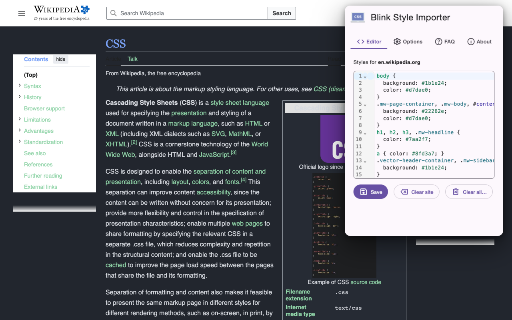
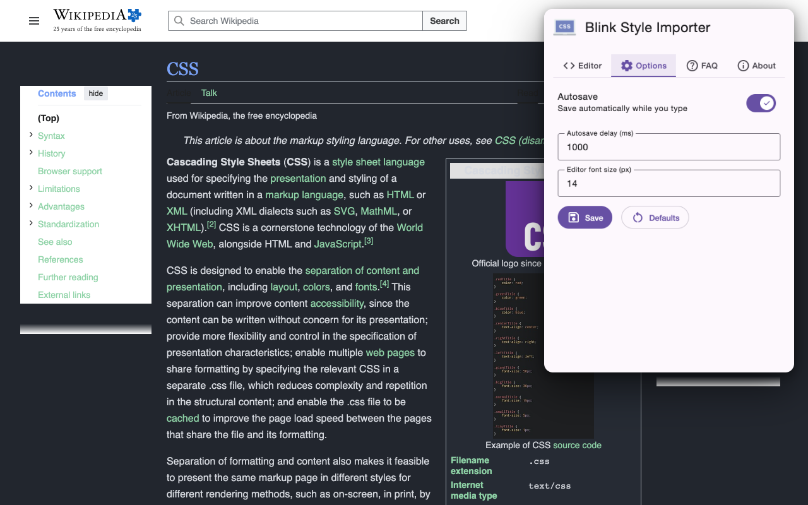

# Blink Style Importer

Chrome extension for adding your own custom CSS styles on any page — with a real code editor.

**[Install from the Chrome Web Store](https://chromewebstore.google.com/detail/blink-style-importer/lbgchcpklbidcojffpncpclnkopchcff)**

## Features

- CSS code editor (CodeMirror 6) with autocomplete, linting, and bracket matching
- Live preview — the open page restyles as you type, auto-saved
- Styles are saved per site and applied automatically on every visit
- Synced across your devices through your Chrome account
- Minimal permissions, no tracking, no network requests — see the [Privacy Policy](PRIVACY.md)

## Version history

See the [Changelog](CHANGELOG.md).

> Note: version 1.0.0 is a full Manifest V3 rewrite. Styles saved by 0.x versions are not carried over.

## Feedback

Bugs and ideas → [issues](https://github.com/FreakyMithril/blink-style-importer/issues).

## License

[MIT](LICENSE)
